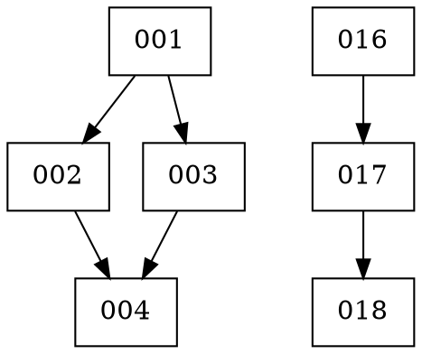

# Issue 038: Dependency Visualization and Branch Topology Tool

## Current Behavior

The `reconstruct-history.sh` script (Issue 035b) already parses issue dependencies and builds a directed graph for topological sorting. However, this information is only used internally for commit ordering - there's no way to:

1. **Visualize** the dependency tree
2. **Query** impact relationships ("what does X block?")
3. **Generate** branch topologies from dependencies

The dependency data exists but isn't exposed in a useful format for understanding project structure or debugging.

## Intended Behavior

Create a tool that leverages the existing dependency graph to provide:

### 1. ASCII Tree Visualization
```
Project Dependency Tree
========================

├── 001 (Setup foundation)
│   ├── 002 (Build parser)
│   │   └── 004 (Integration)
│   └── 003 (Create config)
│       └── 004 (Integration)
├── 016 (Design markup)
│   └── 017 (Implement engine)
│       └── 018 (Discovery system)
└── 024 (External directories)
```

### 2. DOT Format Export (for Graphviz)


Usage: `./visualize-deps.sh --dot | dot -Tpng -o deps.png`

### 3. Impact Analysis Queries
```bash
# What does issue 003 block?
$ ./visualize-deps.sh --blocks 003
003 blocks: 004, 007, 012

# What does issue 012 depend on?
$ ./visualize-deps.sh --depends 012
012 depends on: 001 → 003 → 004 → 007 → 012

# What can be worked on in parallel right now?
$ ./visualize-deps.sh --parallel
No dependencies (can start now): 001, 016, 024
After 001: 002, 003, 009
After 016: 017
```

### 4. Optional Branch Topology Generation
```bash
# Create branches following dependency structure
$ ./visualize-deps.sh --create-branches

Created branches:
  issue-001 (from main)
  issue-002 (from issue-001)
  issue-003 (from issue-001)
  issue-004 (from merge of issue-002 + issue-003)
```

## Suggested Implementation Steps

### 1. Create Script Skeleton
```bash
#!/usr/bin/env bash
# visualize-deps.sh - Dependency visualization and analysis tool
#
# Generates tree diagrams, DOT graphs, and impact analysis from
# issue file dependency metadata.

set -euo pipefail

# -- {{{ Configuration
DIR="${DIR:-/mnt/mtwo/programming/ai-stuff}"
SCRIPT_DIR="$(cd "$(dirname "${BASH_SOURCE[0]}")" && pwd)"
PROJECT_DIR=""
OUTPUT_FORMAT="ascii"  # ascii, dot, json
QUERY_MODE=""          # blocks, depends, parallel, roots
QUERY_TARGET=""
CREATE_BRANCHES=false
INCLUDE_PENDING=false  # Include non-completed issues
# }}}
```

### 2. Reuse Existing Dependency Functions
Import or source the dependency parsing functions from `reconstruct-history.sh`:
- `extract_issue_id()`
- `parse_issue_dependencies()`
- `parse_issue_blocks()`
- `build_dependency_graph()`

### 3. Implement ASCII Tree Generator
```bash
# -- {{{ generate_ascii_tree
generate_ascii_tree() {
    local issues_dir="$1"

    # Find root nodes (issues with no dependencies)
    local -a roots=()
    local -A all_deps

    for issue_file in "$issues_dir"/*.md; do
        [[ ! -f "$issue_file" ]] && continue
        local id=$(extract_issue_id "$issue_file")
        [[ -z "$id" ]] && continue

        local deps=$(parse_issue_dependencies "$issue_file")
        all_deps["$id"]="$deps"

        [[ -z "$deps" ]] && roots+=("$id")
    done

    # Sort roots for consistent output
    mapfile -t roots < <(printf '%s\n' "${roots[@]}" | sort -V)

    echo "Project Dependency Tree"
    echo "========================"
    echo ""

    # Recursive printer with box-drawing characters
    print_node() {
        local node="$1"
        local prefix="$2"
        local is_last="$3"

        # Get issue title for context
        local title=""
        local issue_file=$(find "$issues_dir" -name "${node}-*.md" -o -name "${node}.md" 2>/dev/null | head -1)
        if [[ -n "$issue_file" ]]; then
            title=$(grep -m1 '^# ' "$issue_file" 2>/dev/null | sed 's/^# Issue [0-9]*[a-z]*: //' | cut -c1-40)
        fi

        local connector="├──"
        [[ "$is_last" == true ]] && connector="└──"

        printf "%s%s %s" "$prefix" "$connector" "$node"
        [[ -n "$title" ]] && printf " (%s)" "$title"
        echo ""

        # Find children (issues that list this as a dependency)
        local -a children=()
        for other_id in "${!all_deps[@]}"; do
            if echo " ${all_deps[$other_id]} " | grep -q " $node "; then
                children+=("$other_id")
            fi
        done

        # Sort children
        mapfile -t children < <(printf '%s\n' "${children[@]}" | sort -V)

        # Calculate new prefix
        local child_prefix="$prefix"
        [[ "$is_last" == true ]] && child_prefix+="    " || child_prefix+="│   "

        # Print children
        local i=0
        for child in "${children[@]}"; do
            ((i++))
            local child_is_last=false
            [[ $i -eq ${#children[@]} ]] && child_is_last=true
            print_node "$child" "$child_prefix" "$child_is_last"
        done
    }

    # Print from each root
    local i=0
    for root in "${roots[@]}"; do
        ((i++))
        local is_last=false
        [[ $i -eq ${#roots[@]} ]] && is_last=true
        print_node "$root" "" "$is_last"
    done
}
# }}}
```

### 4. Implement DOT Format Export
```bash
# -- {{{ generate_dot_graph
generate_dot_graph() {
    local issues_dir="$1"

    echo "digraph dependencies {"
    echo "  rankdir=TB;"
    echo "  node [shape=box, style=rounded];"
    echo ""

    # Add nodes with labels
    for issue_file in "$issues_dir"/*.md; do
        [[ ! -f "$issue_file" ]] && continue
        local id=$(extract_issue_id "$issue_file")
        [[ -z "$id" ]] && continue

        local title=$(grep -m1 '^# ' "$issue_file" 2>/dev/null | sed 's/^# Issue [0-9]*[a-z]*: //' | cut -c1-30)
        echo "  \"$id\" [label=\"$id\\n$title\"];"
    done

    echo ""

    # Add edges
    for issue_file in "$issues_dir"/*.md; do
        [[ ! -f "$issue_file" ]] && continue
        local id=$(extract_issue_id "$issue_file")
        [[ -z "$id" ]] && continue

        local deps=$(parse_issue_dependencies "$issue_file")
        for dep in $deps; do
            echo "  \"$dep\" -> \"$id\";"
        done
    done

    echo "}"
}
# }}}
```

### 5. Implement Impact Analysis
```bash
# -- {{{ query_blocks
query_blocks() {
    local issues_dir="$1"
    local target="$2"

    echo "Issues blocked by $target:"

    # Direct blocks
    local -a blocked=()
    for issue_file in "$issues_dir"/*.md; do
        [[ ! -f "$issue_file" ]] && continue
        local id=$(extract_issue_id "$issue_file")
        local deps=$(parse_issue_dependencies "$issue_file")

        if echo " $deps " | grep -q " $target "; then
            blocked+=("$id")
        fi
    done

    if [[ ${#blocked[@]} -eq 0 ]]; then
        echo "  (none)"
    else
        printf "  Direct: %s\n" "${blocked[*]}"

        # Transitive blocks (recursive)
        # ... implementation
    fi
}
# }}}

# -- {{{ query_depends
query_depends() {
    local issues_dir="$1"
    local target="$2"

    echo "Dependency chain for $target:"

    # Find the issue file
    local issue_file=$(find "$issues_dir" -name "${target}-*.md" -o -name "${target}.md" 2>/dev/null | head -1)
    if [[ -z "$issue_file" ]]; then
        echo "  Issue $target not found"
        return 1
    fi

    # Build chain recursively
    local -a chain=()
    build_chain() {
        local id="$1"
        local file=$(find "$issues_dir" -name "${id}-*.md" -o -name "${id}.md" 2>/dev/null | head -1)
        [[ -z "$file" ]] && return

        local deps=$(parse_issue_dependencies "$file")
        for dep in $deps; do
            build_chain "$dep"
        done
        chain+=("$id")
    }

    build_chain "$target"

    # Print chain
    local IFS=" → "
    echo "  ${chain[*]}"
}
# }}}

# -- {{{ query_parallel
query_parallel() {
    local issues_dir="$1"

    echo "Parallel work opportunities:"
    echo ""

    # Group by dependency depth
    local -A depths
    # ... calculate depths using BFS

    echo "  No dependencies (can start now):"
    # ... list depth-0 issues

    echo ""
    echo "  After completing depth-0:"
    # ... list depth-1 issues
}
# }}}
```

### 6. Add CLI Interface
```bash
# -- {{{ parse_args
parse_args() {
    while [[ $# -gt 0 ]]; do
        case "$1" in
            -p|--project)
                PROJECT_DIR="$2"
                shift 2
                ;;
            --ascii)
                OUTPUT_FORMAT="ascii"
                shift
                ;;
            --dot)
                OUTPUT_FORMAT="dot"
                shift
                ;;
            --json)
                OUTPUT_FORMAT="json"
                shift
                ;;
            --blocks)
                QUERY_MODE="blocks"
                QUERY_TARGET="$2"
                shift 2
                ;;
            --depends)
                QUERY_MODE="depends"
                QUERY_TARGET="$2"
                shift 2
                ;;
            --parallel)
                QUERY_MODE="parallel"
                shift
                ;;
            --roots)
                QUERY_MODE="roots"
                shift
                ;;
            --create-branches)
                CREATE_BRANCHES=true
                shift
                ;;
            --include-pending)
                INCLUDE_PENDING=true
                shift
                ;;
            -I|--interactive)
                INTERACTIVE=true
                shift
                ;;
            -h|--help)
                show_help
                exit 0
                ;;
            *)
                PROJECT_DIR="$1"
                shift
                ;;
        esac
    done
}
# }}}
```

### 7. Help Text
```
Usage: visualize-deps.sh [OPTIONS] <project-directory>

Visualize and analyze issue dependencies.

Output Formats:
    --ascii          ASCII tree diagram (default)
    --dot            DOT format for Graphviz
    --json           JSON format for programmatic use

Queries:
    --blocks ID      Show what issue ID blocks (direct + transitive)
    --depends ID     Show dependency chain for issue ID
    --parallel       Show issues that can be worked on in parallel
    --roots          Show issues with no dependencies

Options:
    -p, --project DIR    Project directory
    --include-pending    Include non-completed issues
    --create-branches    Create git branches from topology
    -I, --interactive    Interactive mode
    -h, --help           Show this help

Examples:
    # Show dependency tree
    visualize-deps.sh /path/to/project

    # Export to PNG via Graphviz
    visualize-deps.sh --dot /path/to/project | dot -Tpng -o deps.png

    # What does issue 003 block?
    visualize-deps.sh --blocks 003 /path/to/project

    # Full dependency chain for issue 012
    visualize-deps.sh --depends 012 /path/to/project
```

## Files to Create

- `delta-version/scripts/visualize-deps.sh` - Main script

## Files to Modify

- `delta-version/issues/progress.md` - Add new issue
- `delta-version/docs/table-of-contents.md` - Add branch topology doc

## Dependencies

- **Issue 035b**: Provides dependency parsing functions (can import or copy)
- **Optional**: `graphviz` package for DOT → PNG conversion

## Testing Strategy

### Test 1: ASCII Output
```bash
./visualize-deps.sh /mnt/mtwo/programming/ai-stuff/delta-version
# Should show tree with 001 as root, branching to 009, 004, etc.
```

### Test 2: DOT Export
```bash
./visualize-deps.sh --dot /mnt/mtwo/programming/ai-stuff/delta-version > deps.dot
dot -Tpng deps.dot -o deps.png
# Open deps.png, verify graph structure
```

### Test 3: Impact Query
```bash
./visualize-deps.sh --blocks 001 /mnt/mtwo/programming/ai-stuff/delta-version
# Should list all issues that depend on 001
```

### Test 4: Parallel Analysis
```bash
./visualize-deps.sh --parallel /mnt/mtwo/programming/ai-stuff/delta-version
# Should group issues by dependency depth
```

## Related Documents

- `docs/branch-topology-and-dependency-visualization.md` - Concept exploration
- `scripts/reconstruct-history.sh` - Source of dependency parsing functions
- Issue 035b - Dependency graph implementation

## Metadata

- **Priority**: Medium
- **Complexity**: Medium
- **Dependencies**: Issue 035b (completed)
- **Blocks**: None
- **Status**: Ready for implementation

## Success Criteria

- [ ] ASCII tree output shows correct parent-child relationships
- [ ] DOT export produces valid Graphviz input
- [ ] `--blocks` query shows direct and transitive blocks
- [ ] `--depends` query shows full dependency chain
- [ ] `--parallel` identifies concurrent work opportunities
- [ ] `--roots` lists all issues with no dependencies
- [ ] Help text documents all options
- [ ] Works with both completed and pending issues (with flag)
