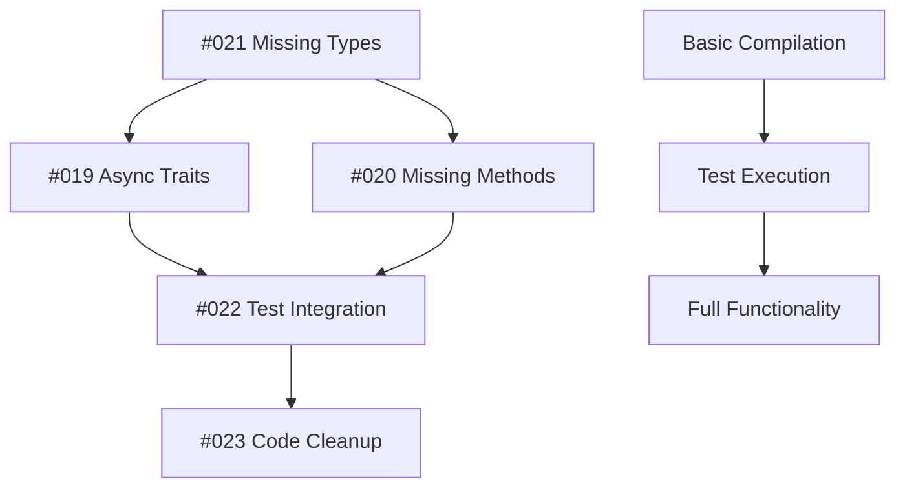

# Issue #024: Compilation Errors Master Tracking Issue

## Priority: CRITICAL 🚨

## Description
This is a master tracking issue for all compilation errors discovered during the comprehensive test suite implementation. These errors prevent the codebase from compiling and must be resolved to enable the new testing infrastructure and core functionality.

## Compilation Error Categories

### 🚨 **CRITICAL BLOCKERS (Must Fix First)**
These issues prevent basic compilation:

#### **#021: Missing Type Definitions and Imports**
- **Status**: 📋 Open
- **Blocking**: All functionality
- **Dependencies**: Missing crates in Cargo.toml, undefined core types
- **Estimate**: 2-3 hours
- **Key Types Missing**: `RelationshipId`, `LLMEndpoint`, `ImageEndpoint`, etc.

#### **#019: Async Trait Object Safety Violations**  
- **Status**: 📋 Open
- **Blocking**: Bytecode executor, laptop daemon
- **Dependencies**: `async-trait` crate
- **Estimate**: 1-2 hours
- **Solution**: Add `#[async_trait]` to all async traits

#### **#020: Missing Struct Fields and Methods**
- **Status**: 📋 Open  
- **Blocking**: Core crypto and daemon functionality
- **Dependencies**: Complete struct implementations
- **Estimate**: 3-4 hours
- **Key Missing**: `CryptoConfig` fields, `LaptopDaemon` methods

### ⚠️ **HIGH PRIORITY (Fix After Blockers)**
These issues prevent testing and integration:

#### **#022: Test Compilation Integration Issues**
- **Status**: 📋 Open
- **Blocking**: Test execution
- **Dependencies**: Issues #019, #020, #021 resolved
- **Estimate**: 2-3 hours
- **Focus**: Test adaptation layer, conditional compilation

### 📋 **LOW PRIORITY (Quality Improvements)**
These improve code quality but don't block functionality:

#### **#023: Unused Imports and Code Cleanup**
- **Status**: 📋 Open
- **Blocking**: None (warnings only)
- **Dependencies**: None
- **Estimate**: 1-2 hours
- **Focus**: Automated cleanup with `cargo fix`

## Resolution Dependencies

### **Dependency Chain**


### **Critical Path**
1. **#021** → **#019** → **#020** → **#022** → **#023**
2. Estimated total time: **8-12 hours** for full resolution
3. Minimum viable: **4-6 hours** for basic compilation

## Implementation Strategy

### **Phase 1: Foundation (Priority 1)**
**Target**: Basic compilation success
**Duration**: 4-6 hours
**Issues**: #021, #019, #020

**Steps**:
1. Add missing dependencies to Cargo.toml
2. Create core type definitions file
3. Add `async-trait` to async traits
4. Complete `CryptoConfig` and `LaptopDaemon` implementations

**Success Criteria**:
- `cargo check` succeeds without errors
- Core modules compile
- Basic functionality available

### **Phase 2: Testing Integration (Priority 2)**  
**Target**: Test suite execution
**Duration**: 2-3 hours
**Issues**: #022

**Steps**:
1. Create test integration layer
2. Add conditional compilation for tests
3. Update test runner configuration
4. Verify test execution

**Success Criteria**:
- `cargo test --no-run` succeeds
- Test runner executes without crashes
- Integration tests can run (with mocks if needed)

### **Phase 3: Quality Polish (Priority 3)**
**Target**: Clean compilation output
**Duration**: 1-2 hours  
**Issues**: #023

**Steps**:
1. Run automated cleanup tools
2. Manual review of complex warnings
3. Update CI configuration
4. Documentation updates

**Success Criteria**:
- Minimal compilation warnings
- Clean CI pipeline
- Improved developer experience

## Quick Start Resolution Guide

### **Immediate Actions (30 minutes)**
```bash
# 1. Add critical dependencies
cat >> Cargo.toml << 'EOF'
[dependencies]
async-trait = "0.1"
base64 = "0.21"  
uuid = { version = "1.0", features = ["v4", "serde"] }
thiserror = "1.0"
ed25519-dalek = { version = "2.0", features = ["serde"] }
x25519-dalek = { version = "2.0", features = ["serde"] }
chacha20poly1305 = "0.10"

[dev-dependencies]
tempfile = "3.0"
EOF

# 2. Test basic compilation improvement
cargo check
```

### **Core Type Definitions (1 hour)**
```rust
// Create: src/crypto/types.rs
#[derive(Debug, Clone, PartialEq, Eq, Hash, Serialize, Deserialize)]
pub struct RelationshipId(pub String);

impl RelationshipId {
    pub fn new() -> Self {
        Self(uuid::Uuid::new_v4().to_string())
    }
}

// Additional core types as specified in #021
```

### **Async Trait Fixes (30 minutes)**
```rust
// Add to all async trait definitions:
use async_trait::async_trait;

#[async_trait]
pub trait LocalLLMProvider: Send + Sync {
    async fn generate_text(&self, prompt: &str) -> Result<String, LLMError>;
}
```

## Testing Strategy

### **Validation Steps**
1. **After each phase**, run comprehensive checks:
   ```bash
   cargo check --all-targets
   cargo test --no-run  
   cargo clippy
   ```

2. **Integration validation**:
   ```bash
   # Test specific functionality
   cargo test crypto_tests --no-run
   cargo test bytecode_tests --no-run
   cargo test laptop_daemon_tests --no-run
   ```

3. **Full validation**:
   ```bash
   # Complete test suite
   cargo test --all
   cargo build --all-targets
   ```

## Risk Assessment

### **High Risk Areas**
- **Crypto module complexity** - May have subtle implementation requirements
- **Test integration** - Tests may assume APIs that need significant changes
- **Cross-module dependencies** - Changes may have ripple effects

### **Mitigation Strategies**
- **Incremental approach** - Fix one category at a time
- **Frequent validation** - Test after each major change
- **Rollback plan** - Keep git checkpoints for each working state

### **Success Indicators**
- ✅ `cargo check` passes without errors
- ✅ Basic functionality compiles
- ✅ Test infrastructure works
- ✅ CI pipeline succeeds

### **Failure Indicators**
- ❌ New compilation errors introduced
- ❌ Circular dependency issues
- ❌ Test infrastructure completely broken

## Communication Plan

### **Progress Updates**
- **After Phase 1**: Report basic compilation status
- **After Phase 2**: Report testing capability status  
- **After Phase 3**: Report full system status

### **Issue Updates**
- Link all sub-issues to this master issue
- Update sub-issue status as resolved
- Close this master issue when all sub-issues complete

## Cross-References

### **Sub-Issues**
- **#019**: Async Trait Object Safety Violations
- **#020**: Missing Struct Fields and Methods  
- **#021**: Missing Type Definitions and Imports
- **#022**: Test Compilation Integration Issues
- **#023**: Unused Imports and Code Cleanup

### **Related Work**
- **Testing Infrastructure**: All new test files depend on compilation fixes
- **Architecture Implementation**: Bytecode interface, crypto system, laptop daemon
- **Documentation**: Will need updates after API stabilization

## Success Metrics

### **Quantitative Goals**
- **Compilation**: 0 errors, <20 warnings
- **Test Coverage**: >80% of new functionality  
- **Performance**: Test suite runs in <5 minutes
- **CI Pipeline**: <10 minutes total build time

### **Qualitative Goals**
- **Developer Experience**: Clean compilation output
- **Code Quality**: Consistent style and structure
- **Maintainability**: Clear module organization
- **Testing**: Comprehensive validation of new features

**Filed by**: Comprehensive compilation audit  
**Date**: 2025-01-27  
**Severity**: CRITICAL - Blocks core functionality development  
**Estimated Resolution Time**: 8-12 hours total, 4-6 hours minimum viable